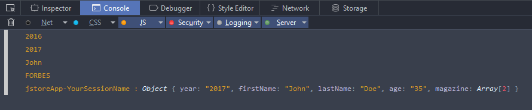

# Angular jStore

The `angular-jstore` module provides a convenient wrapper for to storing JSON objects in the client browser with HTML5 localStorage. 


## Install with package managers

* Bower: bower install angular-jstore --save

* npm: npm install angular-jstore --save


## How to use angular jstore

* Add `angular` and `angular-jstore` to your code:

```html
<script src="angular.js"></script>
<script src="angular-jstore.js"></script>
```

* Add a dependency to the `angular-jstore` module in your application.

```js
var app = angular.module('myApp', ['angular-jstore']);
```

* Setting a prefix for the session name (OPTIONAL)

```js
// Jstore Provider
app.config(['$jstoreProvider', function ($jstoreProvider) {
    $jstoreProvider.setPrefix('appDemo');
}]);
```

* To test see the example below:

```js
app.controller("DemoCtrl", ['$scope', '$jstore', function($scope, $jstore) {

    var SESSION_NAME = "YourSessionName";

    // Check browser support for localStorage
    if (!$jstore.isSupported) {
        alert('Your browser does not support HTML5 Web Storage. Please upgrade to a modern browser.');
        angular.element('body').empty();
        return;
    }

    // Add data in session localStorage
    $jstore.set(SESSION_NAME, { year: "2016" });

    // Display the value in the console
    console.log($jstore.get(SESSION_NAME).year);

    // Change session data
    $jstore.set(SESSION_NAME, { year: "2017" });

    // Display the value in the console
    console.log($jstore.get(SESSION_NAME).year);

    // Personal data
    var personalData = {
        "firstName": "John",
        "lastName": "Doe",
        "age": "35",
    };

    // Add more data in session
    $jstore.set(SESSION_NAME, personalData);

    // Add Array data in session
    $jstore.set(SESSION_NAME, { magazine: [ "FORBES", "VOGUE" ] });

    // Check if you have data in session
    var hasData = $jstore.has(SESSION_NAME);

    // Recover data from session
    var data = $jstore.get(SESSION_NAME);

    // Displays the values in the console
    console.log(data.firstName);
    console.log(data.magazine[0]);

    // Count total sessions created
    var count = $jstore.count();

    // Displays data for all created sessions
    $jstore.each(function(k, v) {
        console.log(k,':',v);
    });

    // Clears data from a specific session in localStorage
    $jstore.remove(SESSION_NAME);

    // Clears all data from the localStorage
    $jstore.clear();

}]);
```


### Console Output




## License

Released under the terms of MIT License.

See [MIT license](http://opensource.org/licenses/MIT "MIT License")